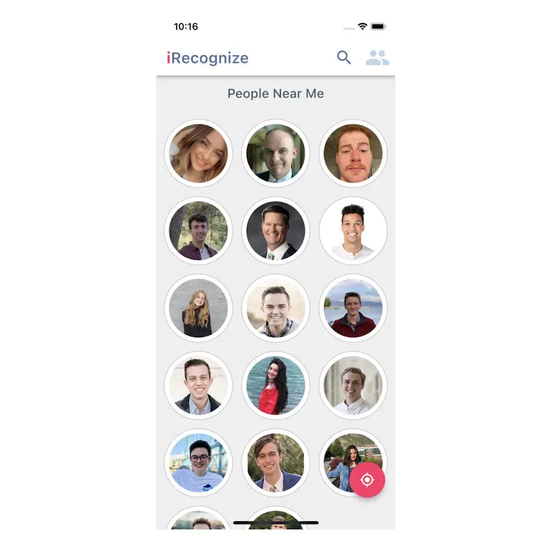
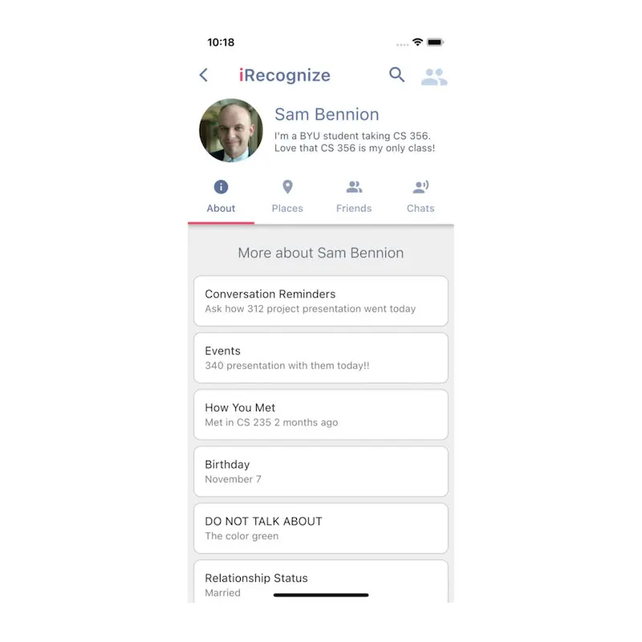
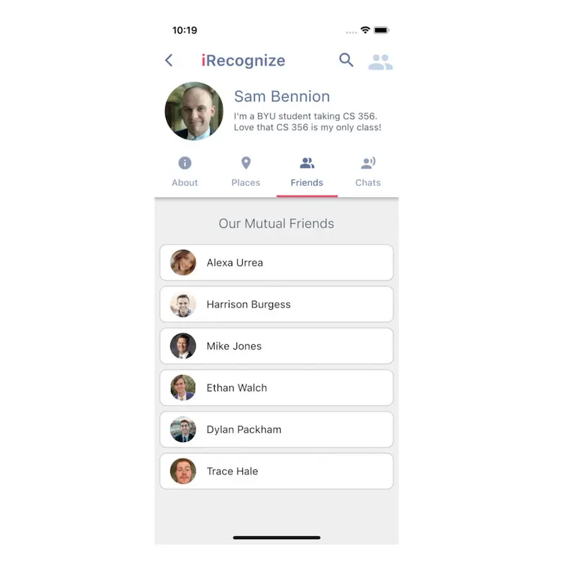
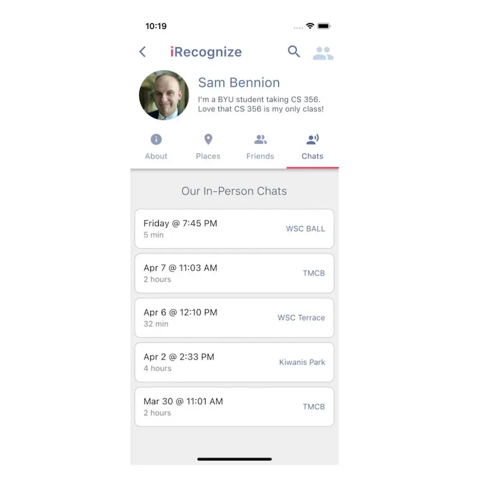

# irecognize

Flutter app to help people reconnect meaningfully with individuals they recognize.

For BYU's CS 356 UI/UX Design class project, my group of 3 made a mobile app throughout the second half of the semester. We found that it's hard to remember people's names, and sometimes important details about where you two met or other relevant info about them. We made a Figma prototype and then a Flutter app that demos how you could use your GPS to locate those around you and be able to put names to faces.

[Mobile App User Guide](./README-assets/README-mobile-user-guide.pdf)

